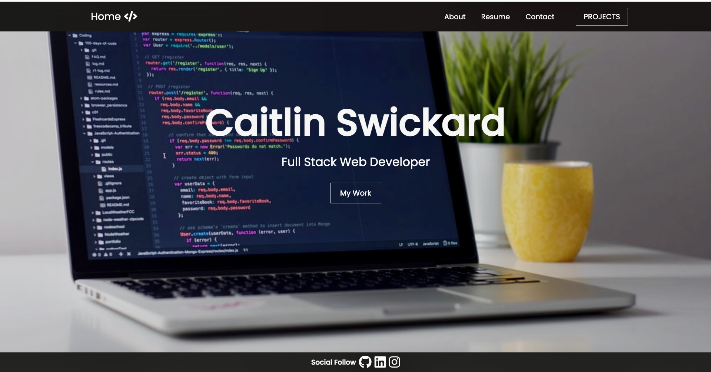
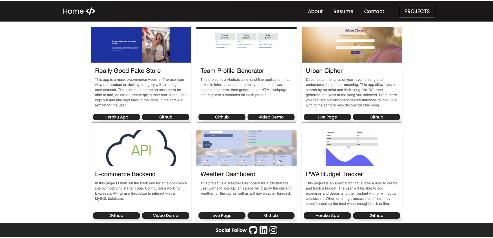

# Professional Portfolio - Built with React

This project is a personal portfolio for myself built with react. This portfolio is a single page application. It is complete with a navigation bar that directs the users between an About, Resume, Contact and Projects page. The Projects page is complete with six of my personal application with links to the deployed app and the github repo for that project. The Resume page has a list of technical skill as well as a button to download a PDF of my resume. The Contact page is completed with a form for a user to fill out complete with validation. This form is not linked to submit the information. The footer links between all pages and houses all the social following links. This portfolio is mobile responsive to multiple screen sizes. 

- [Installation](#install)
- [Usage](#usage)

## Install

Clone project
Run the following line of code in your terminal to install all the needed package.json:

```
npm i
```

## Usage

Once all the packages have been installed, open terminal and run the following code in command line :

```
npm start
```

This application runs on localhost:3000. This app should automatically open a new window in the browser for the user to see and explore the page.

## Built With

React
- material-ui

HTML
CSS
JavaScript

## View





### Credits
Navbar Tutorial: [Brian Design](https://www.youtube.com/watch?v=I2UBjN5ER4s)
Material UI Cards Tutorial: [Net Ninja](https://www.youtube.com/watch?v=M75MUZ1zVYM&t=555s)
Material UI Form input Tutorial: [Net Ninja](https://www.youtube.com/watch?v=sTdt2cJS2dg&t=625s)
